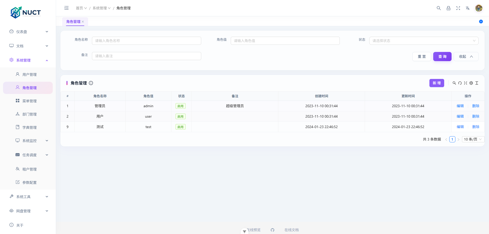

<p align="center">
  
  </p>

   


<p align="center">
  <strong>你只需要关注业务，将基础设施交给Nuct！</strong>
</p>

<p align="center">
  <strong>基于 NestJs +Vue3的企业级前后端分离快速开发脚手架</strong>
</p>


## 系统截图 📸




## 演示地址
- https://nuct.cn

## 项目启动前的准备工作

- sql 文件：[/deploy/sql/nest_admin.sql](https://github.com/zeeklog/nuct/tree/main/deploy/sql/nest_admin.sql) 用于数据库初始化
- 项目相关配置，如：配置 mysql 和 redis 连接
  - 公共配置: [.env](https://github.com/zeeklog/nuct/blob/main/.env)
  - 开发环境: [.env.development](https://github.com/zeeklog/nuct/blob/main/.env.development)
  - 生产环境: [.env.production](https://github.com/zeeklog/nuct/blob/main/.env.production)

## 环境要求

- `nodejs` `20`+
- `docker` `20.x`+ ，其中 `docker compose`版本需要 `2.17.0`+
- `mysql` `8.x`+
- 使用 [`pnpm`](https://pnpm.io/zh/) 包管理器安装项目依赖

演示环境账号密码：

|   账号    |  密码  |    权限    |
| :-------: | :----: | :--------: |
| admin | a123456 | 超级管理员 |

> 所有新建的用户初始密码都为 a123456

本地部署账号密码：

|   账号    |  密码  |    权限    |
| :-------: | :----: | :--------: |
| admin | a123456 | 超级管理员 |

## 快速体验

启动成功后，通过 <http://localhost:7001/api-docs/> 访问。

```bash
pnpm docker:up
# or
docker compose --env-file .env --env-file .env.production up -d --no-build
```

停止并删除所有容器

```bash
pnpm docker:down
# or
docker compose --env-file .env --env-file .env.production down
```

删除镜像

```bash
pnpm docker:rmi
# or
docker rmi zeeklog/nuct-server:stable
```

查看实时日志输出

```bash
pnpm docker:logs
# or
docker compose --env-file .env --env-file .env.production logs -f

```

## 本地开发

- 获取项目代码

```bash
git clone https://github.com/zeeklog/nuct
```

- 【可选】如果你是新手，还不太会搭建`mysql/redis`，你可以使用 `Docker` 启动指定服务供本地开发时使用, 例如：

```bash
# 启动MySql服务
docker compose --env-file .env --env-file .env.development run -d --service-ports mysql
# 启动Redis服务
docker compose --env-file .env --env-file .env.development run -d --service-ports redis
```

- 安装依赖

```bash
cd nuct

pnpm install

```

- 运行
  启动成功后，通过 <http://localhost:7001/api-docs/> 访问。

```bash
pnpm dev
```

- 打包

```bash
pnpm build
```

## 数据库迁移

1. 更新数据库(或初始化数据)

```bash
pnpm migration:run
```

2. 生成迁移

```bash
pnpm migration:generate
```

3. 回滚到最后一次更新

```bash
pnpm migration:revert
```

更多细节，请移步至[官方文档](https://typeorm.io/migrations)

> [!TIP]
> 如果你的`实体类`或`数据库配置`有更新，请执行`npm run build`后再进行数据库迁移相关操作。

## 系统截图


### 欢迎 Star && PR

**如果项目有帮助到你可以点个 Star 支持下。有更好的实现欢迎 PR。**

### 致谢

- [sf-nuct](https://github.com/hackycy/sf-nuct)
- [nuct](https://github.com/zeeklog/nuct)

### LICENSE

[MIT](LICENSE)
